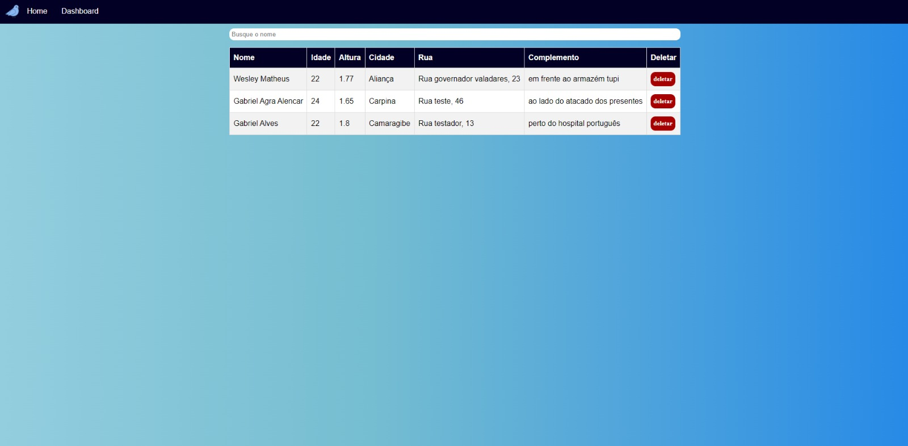

## **Breve descrição geral do sistema**

A criação de um sistema de cadastro e controle de informações na área de saúde é indispensável, pois é a partir dele, que se armazena, trata e gerencia dados que serão usados para alguma finalidade. 

Dito isso, sabe-se que, algumas prefeituras de cidades de interior, ainda enfrentam dificuldades ou carecem de um suporte tecnológico adequado para gerenciar as informações sobre sua população. 

Considerando essa necessidade, foi proposto criar um sistema que beneficie tantos os profissionais responsáveis pelo tratamento dos dados quanto à população em geral. 
Com esse sistema, as informações serão depositadas em um único local, evitando a perda de dados importantes e sensíveis.

## **Escopo**

O sistema terá funcionalidade padrão, incluindo requisitos funcionais e não funcionais e algumas funcionalidades extras que poderão agregar ao sistema.

* Entre os requisitos funcionais estão: cadastro de paciente; pesquisa cliente; alteração do cadastro; exlusão do cadastro; agendamento de consulta e emissão de relatórios.
* Os requisitos não funcionais incluirão métricas de desempenho, usabilidade, segurança, hardware e software.

## **Prototipo das telas:**

Tela Inicial

A tela para cadastro dos pacientes:

A tela para visualização ds dados cadastrados:

